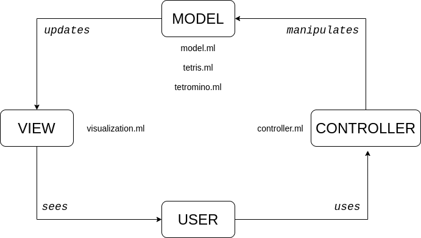

# __OCaml Tetris Writeup__

In this writeup, we will explain the functionality in each of the files, and then bring it all together and walk through the operation of the game.

Our Tetris implementation is split into six different files: Tetris, Model, Visualization, Tetrominoes, Controller, and Config. Tetris includes the main game loops; Model defines the `model` type and useful functions that operate on the model; Visualization encompasses the functions used to visualize the game; Tetrominoes defines both the tetromino class and the square class of which tetrominoes are composed of; Controller defines the functionality used for users to interact with the game; and finally Config stores initial configuration values and type definitions that the rest of the game draws from.

   

---

## Model

One of the most important concepts in our implementation is the model, which represents the playfield or “matrix”. At any given time, our model stores the state of the board in a two dimensional matrix of integers using the default OCaml `Array` type. The elements of the array are initially set to 0, the value representing an empty square. As the game progresses, these 0’s are replaced by hex values of the color corresponding to the tetromino placed.

Critically, the model does not store the current active tetromino under the player’s control. Instead, the model stores the environment while the active tetromino is treated as the player in the environment. It is only when the falling tetromino “reaches the bottom” that the model is modified to include the current tetromino and a new active tetromino is created.

The model is defined as an array of integer arrays such that each element of the model represents a row of elements. Moreover, the model is defined such that the rows are indexed from the bottom up. As per the `Array` module, an element of a model `m` is accessed using `m.(row).(column)`. The model was defined in such a way in order to facilitate the clearing of lines.

### Additional functions

The `sq_full` function defined in `model.ml` simply takes in an `x`, `y` position and a model and returns whether the position is “occupied” in the model or is out of bounds. A single exception to this exists where the function returns false if the piece is within the `x` boundaries but above the upper `y` boundary of the model.

The `clear_lines` function takes a model as an argument and destructively clears lines (rows) that are fully occupied. This is done through a `for` loop, which checks each row for the existence of an empty square. If no empty squares exist in a row, a `shift` counter (initially set to 0) is incremented and subsequent rows take on the value of the row `shift` positions up. Once this is done over the entire model, the function then sets the top `shift` rows to new arrays of empty squares (again simply `0`).

## Tetromino

The tetromino file provides the definition of a tetromino and its methods. `tetromino.ml` contains two classes: `square` and `tetromino`. A `square` represents a single square block in a tetromino while a `tetromino` essentially represents a list of four squares with additional functionality (the “four” here follows from the implementation of the game and is not hard coded into the class definition). These two classes provide the full framework for a controllable tetromino.

### Square class

Each square object is initialized with `x` and `y` coordinates. These values are stored in mutable variables alongside functions for retrieving and setting this position.

 a function that returns the position of the moved square, and a function that adds that square to a model. Nothing too complex.

### Tetromino class

This is where the action happens. The only argument is an algebraic data type that stores all the pieces. The center for each piece is set to column 4, row 20. The initializer matches on the piece argument and creates the necessary squares.

In order to move the tetromino, first the moved positions are calculated as the variable `shifted`. Then those positions are checked against the model. If none of them intersect, then the shifted positions become the real positions and true is returned. In the case of NoAction or an intersection with the model, false is returned. In the case of a Drop, the piece is moved down until false is returned.

## Controller

Simple function checks if a key has been pressed and then matches the input with the corresponding action. If no key is pressed or if the key does not correspond to an action, NoAction is returned.

## Visualization

This is where all the gritty work happens drawing the board. Mostly self-explanatory, `draw_grid_lines` draws grid lines, and `fill_square` fills the given square. The `init_graph` function opens the graph and draws lines.

The `render_model` function takes a model and renders it with a double for loop. If the value in the model is true, it fills that square. `render_piece` iterates over each square in the piece and fills it. `render_text` takes a score and level and then renders the appropriate text along with the control instructions.

## Bringing it all together

## Tetris Gameplay

Enjoy! I had a lot of fun procrastinating other finals by “playtesting.”
